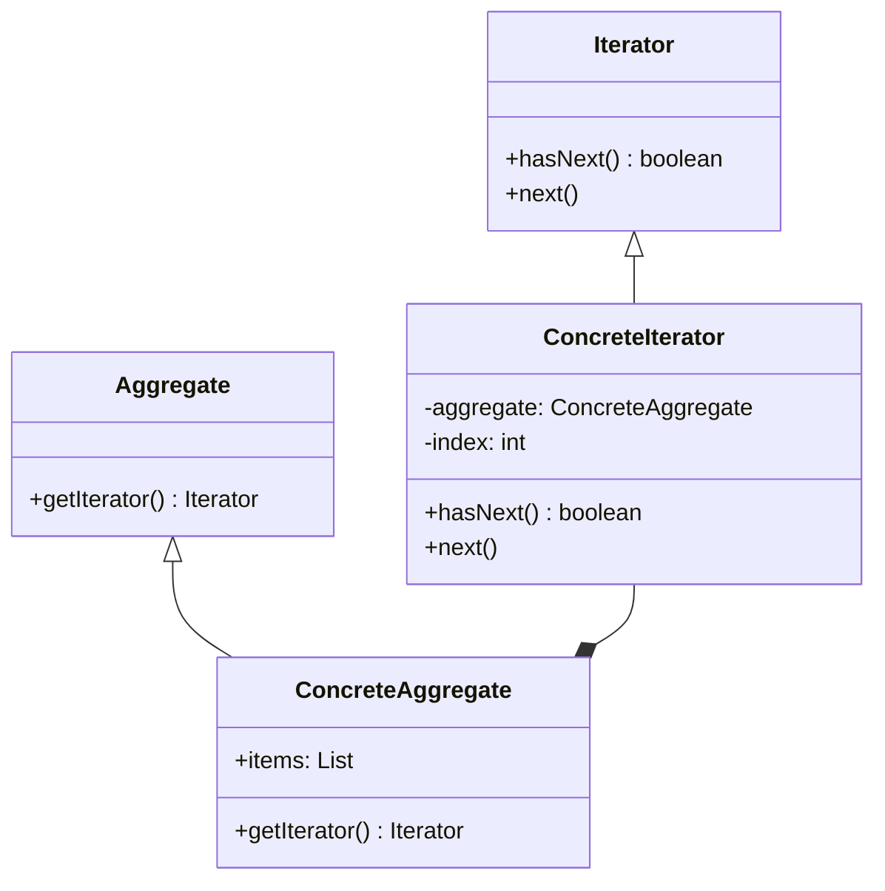

# Iterator パターン

##　概要
コレクションの内部構造を利用者に見せずに、その要素に順番にアクセスする方法を提供するパターンである

- ループ処理のインデックスの役割を抽象化したもの

**Iterator**
コレクションを探索

**ConcreteIterator**

- Iterator で定義したメソッドを実装するクラス
- 実装によって探索の内容を変化することができる
- 探索を行うコレクションをフィールドに持つ

**Aggregate**

- 探索を行うコレクションを表すこれスクションを表すインターフェース
- イテレータを生成するためのメソッドを定義する

**ConcreteAggregate**

- Aggregate で定義したメソッドを実装するクラス
- ConcreteIterator クラスの新しいインスタンスを返却する

## メリット

- 利用者がコレクションの詳細なデータ構造を知る必要がない
- コレクションの実装と探索のアルゴリズムを分離できる
- 既存のコードに修正を加えることなく、新しい種類のコレクションやイテレータを追加できる

## デメリット

単純なコレクションの場合オーバーエンジニアリングになる

## 使い所

- コレクションが複雑なデータ構造をしていて、その複雑さを利用者から隠したい場合
- オープンクローズドの原則に違反することなく探索のためのロジックを追加可能
