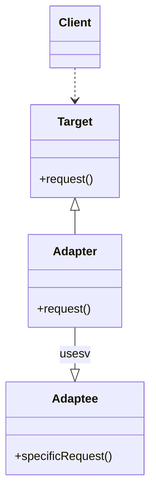

# Adapter パターン

## 概要

あるクラスのインターフェースを、そのクラスを利用する側が求める他のインターフェースへ変換するパターンのことである

### 継承、委譲、ポリモーフィズムを利用したパターン

- 継承を使用した実装では、Adapter が Adaptee クラスを継承して、新しいインターフェースを提供する

- 委譲を使った実装は、Adaptee クラスをフィールドに持つクラスを用意し、そのフィールドに処理を任せて、新しいインターフェースを提供する

### 例

日本と海外のコンセントの変換アダプター

## メリット

- 既存のクラスを修正しないので、再テストが不要になる
- 変換のためのコードをプログラムのビジネスロジックと分離できるので、単一責任の原則に違反しない
- インターフェースを介して、アダプタと連携するので、オープンクローズドの原則に違反しないこと

## デメリット

インターフェースやクラスが増えるから、小さいシステムでは、直接修正した方がいい場面が存在する

## 使い所

- 既存のクラスを使用したいが、そのインターフェースが利用したい側のコードと互換性がない場合
- 外部ライブラリを使いたいが、そのデータ形式が合わない時
